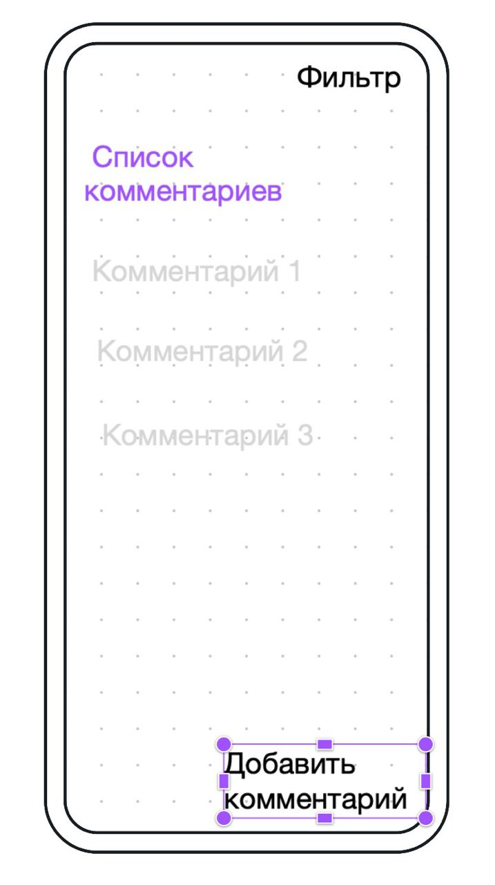

# otuskotlin-test-project

Компонент микроблог для мобильного приложения с системой рейтинга

Идея - пользователи приложения присылают свои советы/рецепты (например по игре) в телеграмм-бот или на почту администратору
проекта. Администратор модерирует сообщения и публикует (В посте следующая информация: тема, само сообщение и кто его прислал). 
Пользователи могут голосовать за каждое сообщение (лайки/дизлайки) полезный или нет данный совет/рецепт.
Необходимо реализовать возможность выводить новые посты и по рейтингу в порядке убывания за неделю/месяц.

## Визуальная схема фронтенда

## Документация

1. Маркетинг
   1. [Заинтересанты](./docs/01-marketing/01-stakeholders.md)
   2. [Целевая аудитория](./docs/01-marketing/02-target-audience.md)
   3. [Конкурентный анализ](./docs/01-marketing/03-concurrency.md)
   4. [Анализ экономики](./docs/01-marketing/04-economy.md)
   5. [Пользовательские истории](./docs/01-marketing/05-user-stories.md)
2. DevOps
   1. [Схема инфраструктуры](./docs/02-devops/01-infrastruture.md)
   2. [Схема мониторинга](./docs/02-devops/02-monitoring.md)
3. Архитектура
   1. [Компонентная архитектура](./docs/04-architecture/01-arch.md)
   2. [Api](./docs/04-architecture/03-api.md)

